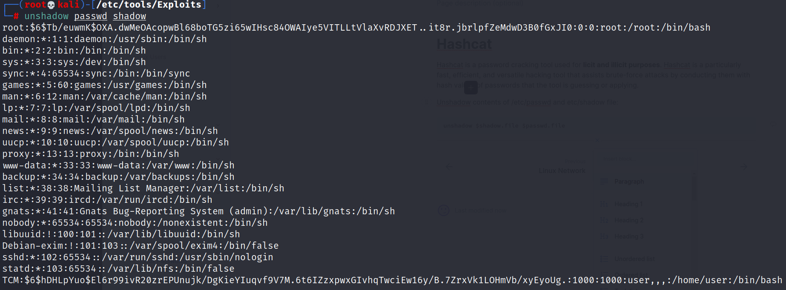

# Linux Passwords

## Hashcat

Hashcat is a password cracking tool used for **licit and illicit purposes**. Hashcat is a particularly fast, efficient, and versatile hacking tool that assists brute-force attacks by conducting them with hash values of passwords that the tool is guessing or applying.

Copy the /etc/passwd and /etc/shadow contents to separate files (passwd & shadow) on your linux machine. Unshadow contents of these files:

```
unshadow $shadow.file $passwd.file
```



Create a new file called crack:

```
vim crack
```

Transfer the results from the unshadow into the crack file:

.png>)

Crack the hashes in the crack file:

```
hashcat -m 1800 crack /usr/share/wordlists/rockyou.txt
```

.png>)
